# This is a simple chat app made by my self.
## These are the steps that you can use to run this project. 
1. First clone this code if you have any github account or you can easily download zip file of this on to your device. Then unzip it in your specific folder 

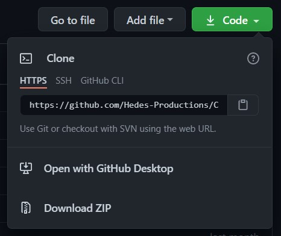 

2. Download nodejs to your pc by following these steps watching this link :- https://www.youtube.com/watch?v=gHuIKptS0Qg&ab_channel=OnlineITtutsTutorials . You just can easyly download node js from their offical site 
3. Download vs code to your pc. You can download it from https://code.visualstudio.com/download . 
4. Download hyper terminal. You can download it from this link. **https://hyper.is/#installation** . After download open it up and then go to the corresponding directory which have unzipped downloaded files. 

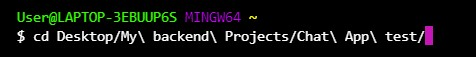 

5. Now use the below code. 

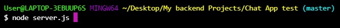 

6. Now try this code to open corresponding file from vs code. 

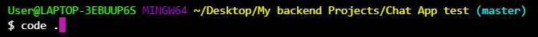 

7. Then download this extension to your vs code. 

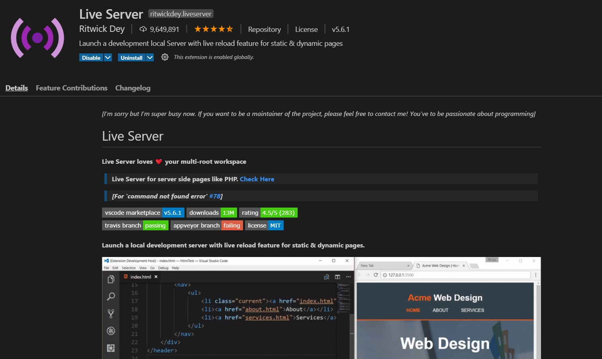 

8. Then go to the index.html file and right click on it's code. Now you can see like this. So now you can click on the **Open with live server.** 

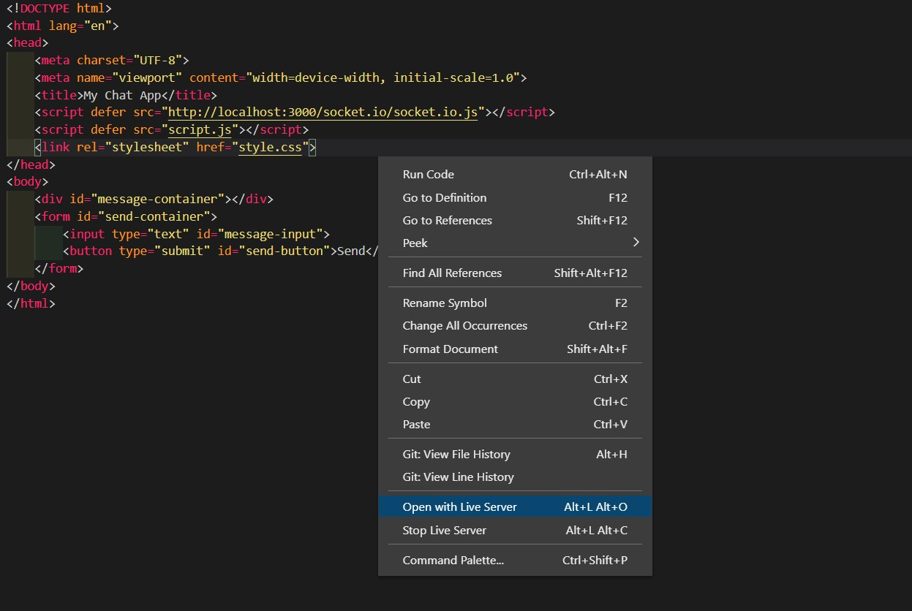 

9. Do that twice. Now you can see like this. 

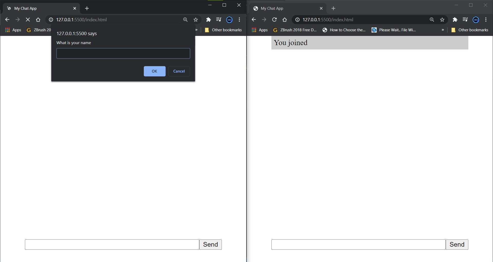 

10. Type your name in the box. 

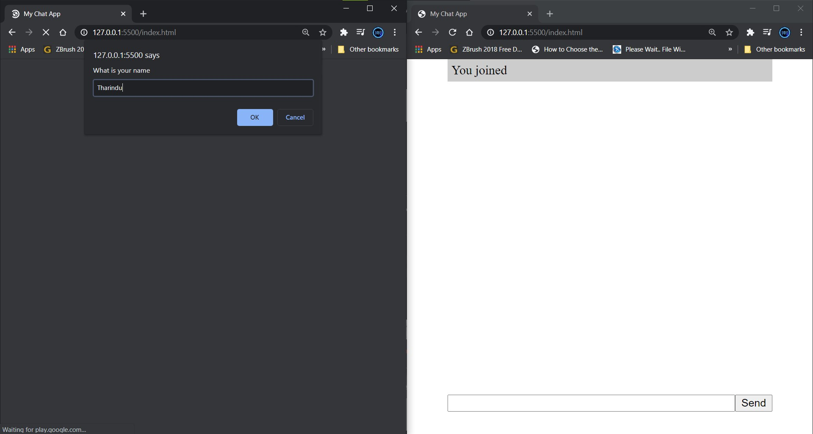 

11. Now you can see two pages like this. In second tab you can see your given name also 

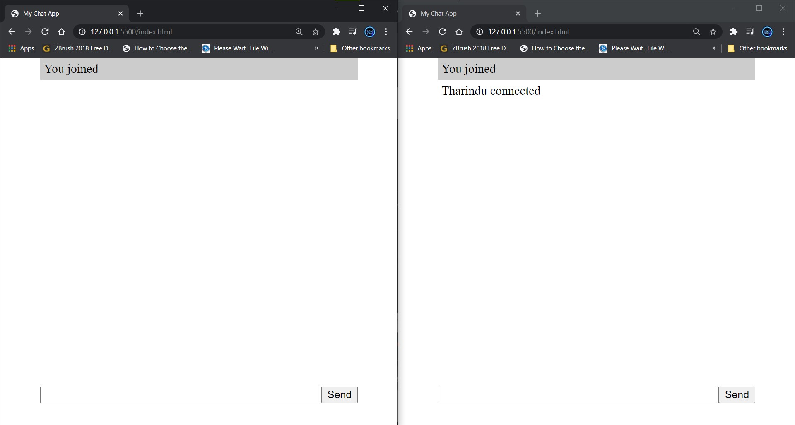 

12. Type a message in 1st tab. 

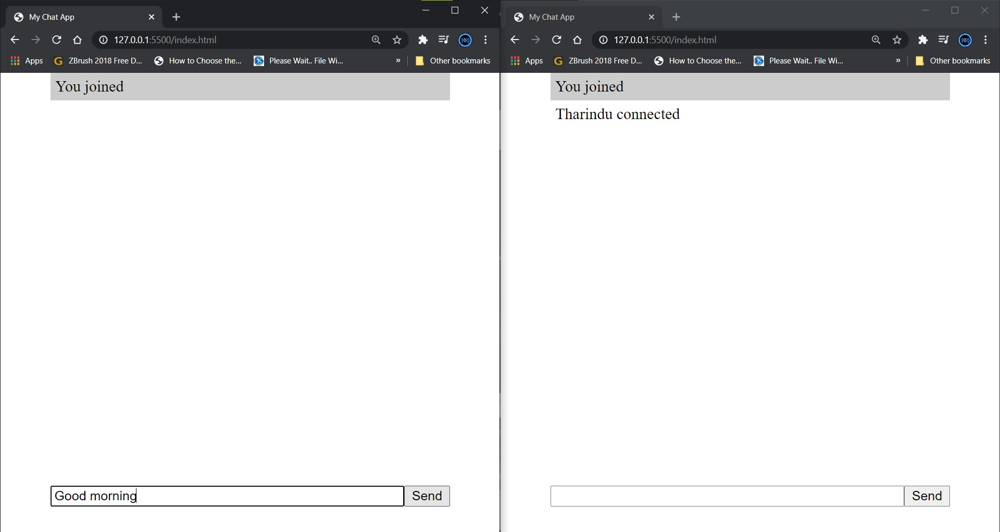 

13. Now type a message in 2nd tab. 

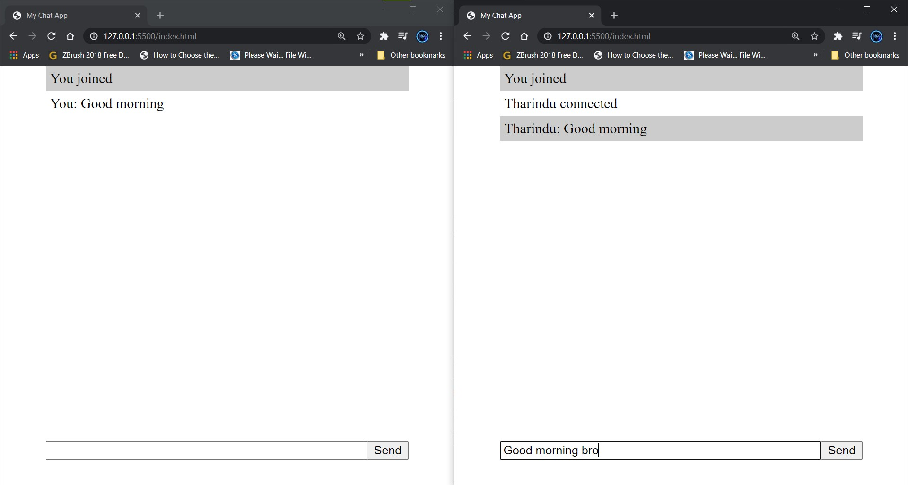 

14. Now you can see that it delivered. 

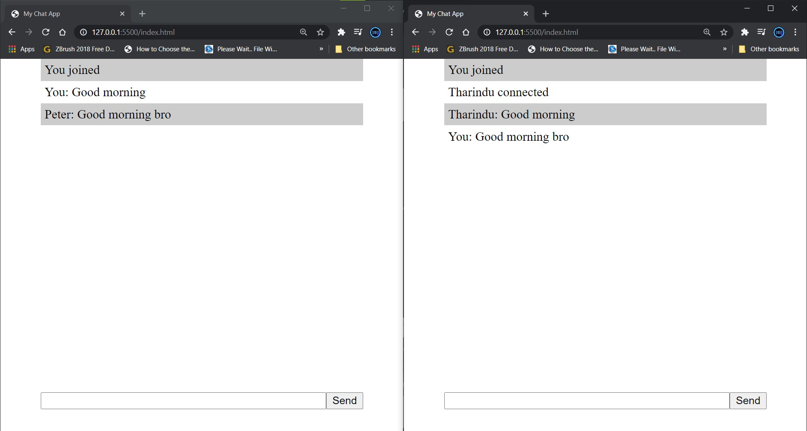
